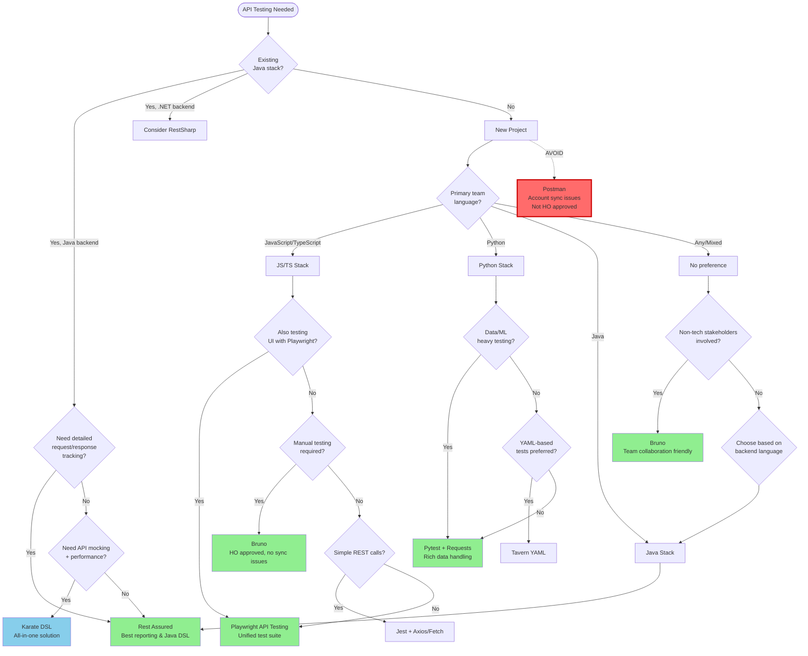

# API Testing Decision Tree

Choose the right API testing framework based on your tech stack, reporting needs, and team collaboration requirements.

## Decision Flowchart



## Key Decision Points

### 1. Java Backend Projects

**Why Rest Assured is Recommended:**

 **Excellent Request/Response Tracking**
- Built-in request/response logging
- Detailed reports show full API conversation
- Easy debugging with complete visibility

 **Java DSL Advantages**
- Fluent, readable syntax
- Type-safe API calls
- Familiar patterns for Java developers

 **Enterprise Integration**
- Deep integration with JUnit/TestNG
- Maven/Gradle support
- CI/CD friendly

**Example:**
```java
given()
    .header("Authorization", "Bearer " + token)
    .contentType(ContentType.JSON)
    .body(requestBody)
.when()
    .post("/api/users")
.then()
    .statusCode(201)
    .body("user.name", equalTo("John"))
    .log().all();  // Full request/response logging
```

**Use Template:** `/templates/api-automation/rest-assured/`

### 2. JavaScript/TypeScript Projects

**If you're already using Playwright for UI:**

 **Playwright API Testing** (Recommended)
- Unified test suite (UI + API)
- Share fixtures and utilities
- One reporting system
- Consistent patterns

**Example:**
```typescript
test('create user via API', async ({ request }) => {
  const response = await request.post('/api/users', {
    data: { name: 'John', email: 'john@example.com' }
  });
  expect(response.status()).toBe(201);
  const user = await response.json();
  expect(user.name).toBe('John');
});
```

**Use Template:** `/templates/ui-automation/playwright/typescript/` (includes API testing)

**If you need manual testing capabilities:**

 **Bruno** (HO Approved)
- No cloud sync (security compliant)
- Git-friendly (collections as files)
- Team collaboration
- Environment management
- Scripting support

**Use Template:** `/templates/api-automation/bruno/`

### 3. Python Projects

**For Data-Heavy Testing:**

 **Pytest + Requests**
- Rich data manipulation with pandas
- Excellent fixtures system
- Parametrization support
- Integration with data pipelines

**Example:**
```python
def test_bulk_user_creation(test_data_df):
    """Test with data from pandas DataFrame"""
    for _, user in test_data_df.iterrows():
        response = requests.post(
            f"{BASE_URL}/api/users",
            json=user.to_dict()
        )
        assert response.status_code == 201
        assert response.json()['name'] == user['name']
```

**Use Template:** `/templates/api-automation/pytest-requests/`

### 4. Karate DSL

**When to Use Karate:**

 **All-in-One Solution Needed**
- API testing + mocking + performance
- No separate tools required
- Gherkin-style syntax

 **Polyglot Teams**
- Less programming required
- DSL readable by non-programmers
- Good for BDD scenarios

**Example:**
```gherkin
Scenario: Create a user
  Given url 'https://api.example.com/users'
  And request { name: 'John', email: 'john@example.com' }
  When method post
  Then status 201
  And match response.name == 'John'
```

**Use Template:** `/templates/api-automation/karate/`

## Framework Comparison

| Framework | Best For | Request/Response Tracking | Reporting | Team Collaboration | Template |
|-----------|----------|---------------------------|-----------|-------------------|----------|
| **Rest Assured** | Java backends |  Excellent |  Very Good |  Good | [Link](/templates/api-automation/rest-assured/) |
| **Bruno** | Manual + Automation |  Very Good |  Good |  Excellent | [Link](/templates/api-automation/bruno/) |
| **Playwright API** | UI + API combined |  Very Good |  Excellent |  Good | [Link](/templates/ui-automation/playwright/typescript/) |
| **Pytest + Requests** | Python/data testing |  Good |  Very Good |  Good | [Link](/templates/api-automation/pytest-requests/) |
| **Karate** | All-in-one solution |  Very Good |  Very Good |  Very Good | [Link](/templates/api-automation/karate/) |
| **Postman** |  Not Recommended |  Very Good |  Good |  Very Good |  Security issues |

## Quick Start Paths

### Path 1: Java Project → Rest Assured

```bash
# 1. Use the template
cp -r /templates/api-automation/rest-assured/ my-api-tests

# 2. Add to pom.xml (already in template)
# rest-assured, junit, hamcrest

# 3. Run tests
mvn test

# 4. View detailed request/response logs in reports
```

### Path 2: Playwright + API Testing

```bash
# 1. Add API tests to existing Playwright project
# See: /templates/ui-automation/playwright/typescript/tests/api/

# 2. Share context between UI and API
# Example: Login via API, test UI

# 3. Unified reporting
npx playwright show-report
```

### Path 3: Bruno for Manual + Automation

```bash
# 1. Install Bruno
# Download from bruno.usebruno.com

# 2. Clone collection template
cp -r /templates/api-automation/bruno/ my-api-collection

# 3. Version control collections
git add bruno-collections/
git commit -m "Add API test collection"

# 4. Run in CI
npm run bruno
```

## Why Not Postman?

 **Not HO Approved** due to:
- **Cloud sync security concerns** - Data leaves HO network
- **Account management issues** - Requires external accounts
- **Compliance risks** - Not suitable for sensitive projects

 **Use Bruno instead:**
- File-based collections (Git-friendly)
- No cloud sync
- Similar UI/UX to Postman
- Open source and HO approved

## 🔑 Request/Response Tracking Comparison

### Rest Assured (Best for Java)
```java
// Automatic detailed logging
.log().all()  // Logs everything
.log().ifValidationFails()  // Smart logging

// Output includes:
// - Request headers, body, cookies
// - Response status, headers, body
// - Timing information
// - Full stack trace on failure
```

### Bruno (Best for Manual Testing)
- Visual request/response viewer
- History tracking
- Environment-specific responses
- Export capabilities

### Playwright API (Best for UI + API)
```typescript
// Built-in request/response capture
const response = await request.post('/api/users', {
  data: userData
});

// Access all response details
console.log(await response.json());
console.log(response.headers());
console.log(response.status());

// Automatic trace with full request/response
// View in Playwright trace viewer
```

## Related Documentation

- [API Automation Tooling Comparison](/docs/tooling/api-automation/tool-comparison.md)
- [API Testing Standards](/docs/standards/api-testing-standards.md)
- [Authentication Patterns](/docs/design-patterns/api-authentication.md)
- [Contract Testing Guide](/examples/integration-examples/contract-testing/)

## Advanced Scenarios

### Scenario 1: Microservices Testing
- Use **contract testing** (Pact) + functional testing
- See: `/examples/integration-examples/contract-testing/`

### Scenario 2: GraphQL APIs
- Playwright API or Rest Assured both support GraphQL
- See: `/examples/real-world-scenarios/graphql-testing/`

### Scenario 3: WebSocket Testing
- Use Playwright (native support)
- See: `/examples/real-world-scenarios/websocket-testing/`

## Still Unsure?

- Review the [Full Stack Decision Tree](./full-stack-decision.md)
- Check [API Tooling Comparison](/docs/tooling/api-automation/tool-comparison.md)
- Contact: Edmond Chhung or Guru Bangalore Venkatesh
- Submit a [Tool Evaluation Request](/.github/ISSUE_TEMPLATE/tool_evaluation.yml)

---

**Last Updated:** October 2025  
**Next Review:** January 2026
