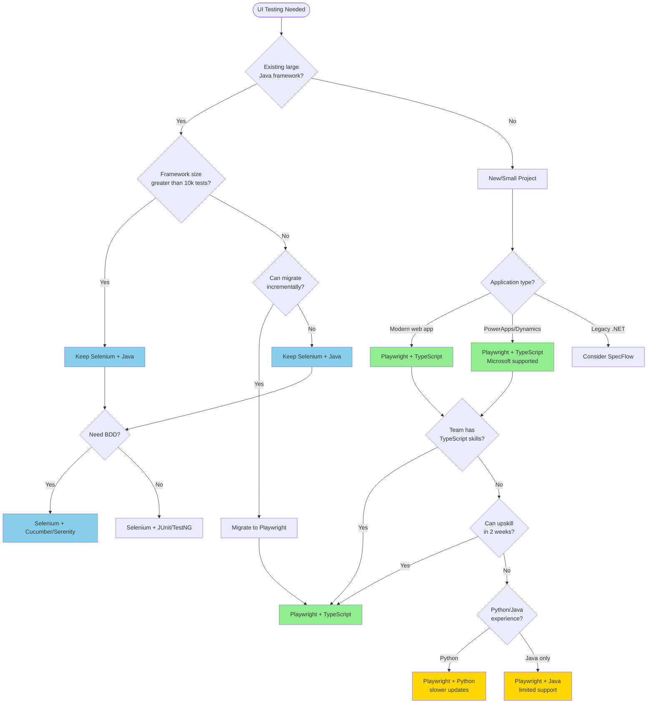

# UI Testing Decision Tree

Choose the right UI automation framework based on your project context, team skills, and existing technology investments.

## Decision Flowchart



## Key Decision Points

### 1. Existing Java Framework Assessment

**If you have a large existing Selenium + Java framework:**

- **Keep it** if:
  - 10,000+ tests in production
  - Team is 100% Java-focused
  - Migration would take 6+ months
  - ROI on migration is unclear

- **Consider migration** if:
  - Framework is small-medium (<5,000 tests)
  - Tests are slow and flaky
  - Team is open to learning TypeScript
  - Modern features (component testing, tracing) needed

### 2. Application Type Matters

**PowerApps / Dynamics 365:**
- **Playwright + TypeScript** is the clear winner
- Microsoft's official support and recommendation
- Native integration and best documentation
- Use template: `/templates/ui-automation/playwright/typescript/`

**Modern Web Applications:**
- **Playwright + TypeScript** recommended
- Fast execution, auto-wait, parallel testing
- Rich debugging (trace viewer, UI mode)
- Use template: `/templates/ui-automation/playwright/typescript/`

**Legacy Applications:**
- **Selenium + Java** acceptable
- Mature, stable, extensive community
- Use template: `/templates/ui-automation/selenium/java-junit/`

### 3. Team Skills Assessment

**TypeScript Skills Available:**
- Go directly to Playwright + TypeScript
- Fastest development cycle
- Best tooling support

**No TypeScript but Quick Learners:**
- Invest 2 weeks in TypeScript training
- Long-term productivity gain
- See: [TypeScript Quick Start Guide](./quick-start-guides/typescript-quick-start.md)

**Python Team:**
- Playwright + Python is acceptable
- Feature parity slightly behind TypeScript
- Updates lag by days/weeks
- Use template: `/templates/ui-automation/playwright/python/`

**Java-Only Team:**
- Playwright + Java has limited support
- Smaller community, slower updates
- Consider Selenium + Java instead
- Use template: `/templates/ui-automation/selenium/java-junit/`

## Framework Comparison

| Framework | Best For | Pros | Cons | Template |
|-----------|----------|------|------|----------|
| **Playwright + TS** | New projects, PowerApps | Fast, modern, Microsoft support | Newer ecosystem | [Link](/templates/ui-automation/playwright/typescript/) |
| **Playwright + Python** | Python teams, data-heavy testing | Python ecosystem, familiar syntax | Slower updates | [Link](/templates/ui-automation/playwright/python/) |
| **Playwright + Java** | Small Java projects | Java integration | Limited support | [Link](/templates/ui-automation/playwright/java/) |
| **Selenium + Java** | Enterprise Java shops | Mature, stable, huge community | Slower, more verbose | [Link](/templates/ui-automation/selenium/java-junit/) |
| **Selenium + Cucumber** | BDD requirements | Business-readable tests | Complexity, slower | [Link](/templates/ui-automation/selenium/java-cucumber/) |
| **Cypress** | Dev-focused JS projects | Developer experience | Limited browser support | Not recommended |

## Quick Start Paths

### Path 1: Greenfield Project → Playwright + TypeScript

```bash
# 1. Use the template
git clone /templates/ui-automation/playwright/typescript/ my-tests

# 2. Install dependencies
npm install

# 3. Run example tests
npx playwright test

# 4. Start building
# See: docs/getting-started/quick-start-guides/playwright-quick-start.md
```

### Path 2: Legacy Java → Stay with Selenium

```bash
# 1. Modernize with latest Selenium 4
# Use template: /templates/ui-automation/selenium/java-junit/

# 2. Add BDD if needed
# Use template: /templates/ui-automation/selenium/java-cucumber/

# 3. Optimize for speed
# See: docs/standards/test-optimization.md
```

### Path 3: Incremental Migration → Hybrid Approach

```bash
# 1. New tests in Playwright
# Existing tests stay in Selenium

# 2. Run both in CI/CD
# See: examples/integration-examples/playwright-selenium-hybrid/

# 3. Migrate gradually
# See: docs/tooling/ui-automation/migration-guide.md
```

## Common Pitfalls

1. **Don't choose based solely on language familiarity**
   - TypeScript is easy to learn (2 weeks)
   - Long-term productivity matters more

2. **Don't ignore Microsoft ecosystem**
   - PowerApps/Dynamics require Playwright
   - Fighting against the ecosystem is costly

3. **Don't migrate just because it's "modern"**
   - Large, stable Selenium frameworks can stay
   - ROI must justify migration effort

4. **Don't mix too many frameworks**
   - One UI framework per project
   - Exceptions: incremental migrations

## Related Documentation

- [Playwright Language Comparison](/tools-strategy/PLAYWRIGHT-TS-PYTHON-JAVA.md)
- [Selenium Guide](/docs/tooling/ui-automation/selenium-guide.md)
- [UI Automation Standards](/docs/standards/ui-automation-standards.md)
- [Page Object Pattern](/docs/design-patterns/page-object-model.md)

## Migration Guides

- [Selenium to Playwright Migration](/docs/tooling/ui-automation/migration-selenium-to-playwright.md)
- [Cypress to Playwright Migration](/docs/tooling/ui-automation/migration-cypress-to-playwright.md)

## Still Unsure?

- Review the [Full Stack Decision Tree](./full-stack-decision.md) for broader context
- Check [UI Automation Tooling Comparison](/docs/tooling/ui-automation/framework-comparison.md)
- Contact the maintainers: Edmond Chhung or Guru Bangalore Venkatesh
- Submit a [Tool Evaluation Request](/.github/ISSUE_TEMPLATE/tool_evaluation.yml)

---

**Last Updated:** October 2025  
**Next Review:** January 2026
