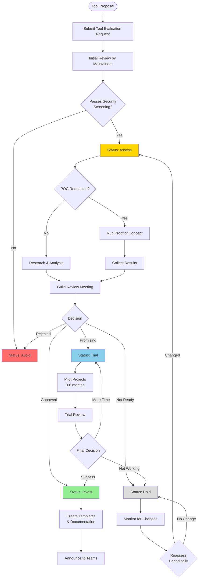

# Tool Approval Process

This document outlines how new tools are evaluated and approved for use within the Home Office QE Guild.

## 🎯 Purpose

The tool approval process ensures that:
- Tools meet HO security and compliance requirements
- Teams have clear guidance on which tools to use
- We avoid tool sprawl and maintain consistency
- Tool decisions are documented and transparent

## 🚦 Tool Status Levels

Tools in the QE Guild are categorized using a modified [Thoughtworks Technology Radar](https://www.thoughtworks.com/radar) approach:

### ✅ **Invest** (Recommended)
- **Description:** Approved for broad adoption across teams
- **Support:** Full guild support, templates provided, training available
- **Examples:** Playwright + TypeScript, Bruno, Rest Assured

### 🔵 **Trial** (Pilot)
- **Description:** Approved for pilot projects and evaluation
- **Support:** Limited guild support, feedback collection in progress
- **Examples:** New frameworks under evaluation

### 🟡 **Assess** (Evaluate)
- **Description:** Interesting but needs more investigation
- **Support:** No official support, POCs welcome
- **Examples:** Emerging tools being researched

### ⚪ **Hold** (Legacy/Acceptable)
- **Description:** Acceptable for existing projects, not recommended for new ones
- **Support:** Maintenance only, no new adoption encouraged
- **Examples:** Large existing Selenium frameworks

### ❌ **Avoid** (Not Recommended)
- **Description:** Not approved due to security, support, or compliance issues
- **Support:** None
- **Examples:** Postman (cloud sync issues)

## 📋 Evaluation Criteria

New tools are evaluated against these criteria:

### 1. Security & Compliance (Critical)
- [ ] No unauthorized cloud data sync
- [ ] Can operate in air-gapped environments
- [ ] Compatible with HO security policies
- [ ] Supports enterprise authentication
- [ ] No telemetry to external services (or can be disabled)

### 2. Microsoft/HO Alignment
- [ ] Microsoft supported/recommended (if applicable)
- [ ] Compatible with PowerApps/Dynamics (if applicable)
- [ ] Aligns with HO technology strategy

### 3. Support & Maintenance
- [ ] Active development and community
- [ ] Commercial support available (if needed)
- [ ] Regular updates and security patches
- [ ] Good documentation

### 4. Technical Fit
- [ ] Solves a real problem better than existing tools
- [ ] Compatible with current tech stacks
- [ ] Reasonable learning curve
- [ ] Good integration capabilities

### 5. Cost Considerations
- [ ] Licensing costs (if any)
- [ ] Training requirements
- [ ] Infrastructure needs
- [ ] Total cost of ownership

### 6. Team Impact
- [ ] Skills available or trainable
- [ ] Hiring pool for new skills
- [ ] Tool maturity and stability
- [ ] Migration effort (if replacing existing tool)

## 🔄 Approval Workflow



## 📝 Step-by-Step Process

### Step 1: Proposal Submission
**Who:** Any QE team member  
**How:** Submit [Tool Evaluation Request](/.github/ISSUE_TEMPLATE/tool_evaluation.yml)

**Required Information:**
- Tool name and category
- Problem it solves
- Comparison with existing tools
- Pros and cons
- License type
- Community support level

### Step 2: Initial Security Review
**Who:** QE Guild Maintainers + Security Team  
**Timeline:** 1-2 weeks

**Actions:**
- Security screening
- Compliance check
- Quick technical review

**Outcomes:**
- ✅ Pass → Move to Assessment
- ❌ Fail → Status: Avoid (with explanation)

### Step 3: Assessment Phase
**Who:** QE Guild Maintainers  
**Timeline:** 2-4 weeks

**Actions:**
- Research tool capabilities
- Review documentation
- Check community/support
- Analyze costs
- Determine if POC is needed

**Outcomes:**
- Status: Assess
- POC plan (if needed)
- Initial recommendation

### Step 4: Proof of Concept (Optional)
**Who:** Volunteer team or maintainers  
**Timeline:** 2-8 weeks

**Actions:**
- Define POC scope and success criteria
- Implement sample tests
- Compare with existing tools
- Document findings
- Collect team feedback

**Deliverables:**
- POC code repository
- Evaluation report
- Recommendation

### Step 5: Guild Review
**Who:** QE Guild Maintainers + Stakeholders  
**Timeline:** 1 meeting

**Actions:**
- Present findings
- Discuss pros/cons
- Consider team feedback
- Make decision

**Outcomes:**
- Status: Invest, Trial, Hold, or Avoid
- Document decision rationale
- Plan next steps

### Step 6: Trial Period (if applicable)
**Who:** Selected pilot teams  
**Timeline:** 3-6 months

**Actions:**
- Use tool on pilot projects
- Collect feedback
- Track metrics
- Document issues and successes

**Metrics:**
- Team satisfaction
- Test development speed
- Test stability/reliability
- Learning curve
- Tool support responsiveness

### Step 7: Final Decision
**Who:** QE Guild Maintainers  
**Timeline:** After trial period

**Outcomes:**
- Invest: Create templates, announce broadly
- Hold: Keep as option but don't promote
- Avoid: Document why and alternatives

### Step 8: Documentation & Rollout
**Who:** Tool owner + Maintainers  
**Timeline:** 2-4 weeks

**Actions:**
- Create template
- Write tooling guide
- Update decision trees
- Add to recommendations
- Announce to teams
- Offer training/workshops

## 📊 Decision Documentation

All tool decisions are documented in:
- [Decision Log](/docs/governance/decision-log.md) - Historical record
- [Tooling Comparisons](/docs/tooling/) - Updated tool pages
- [Decision Trees](/docs/getting-started/decision-trees.md) - Updated if needed

**Decision Log Entry Template:**
```markdown
## [YYYY-MM-DD] Tool Name - Decision

**Status:** Invest/Trial/Assess/Hold/Avoid

**Context:**
What problem prompted this evaluation?

**Decision:**
What did we decide?

**Rationale:**
Why did we make this decision?

**Consequences:**
What are the implications?

**Next Actions:**
What happens next?
```

## 🔄 Periodic Review

Tools are reviewed quarterly to ensure:
- Status is still appropriate
- No security issues have emerged
- Community support remains strong
- Better alternatives haven't appeared

**Review Questions:**
1. Is the tool still actively maintained?
2. Have there been security issues?
3. Is team satisfaction still high?
4. Are there better alternatives now?
5. Should status change?

## 👥 Roles and Responsibilities

### Tool Proposer
- Submit evaluation request
- Provide comprehensive information
- May lead POC if accepted

### QE Guild Maintainers
- Initial screening
- Coordinate reviews
- Make final decisions
- Document outcomes
- Communicate decisions

### POC Team
- Implement proof of concept
- Collect metrics
- Document findings
- Present results

### Pilot Teams
- Use tool during trial
- Provide feedback
- Report issues
- Share learnings

## 🚀 Fast-Track Approval

Some tools may be fast-tracked if they meet these criteria:
1. **Microsoft recommended** for PowerApps/Dynamics
2. **Security pre-approved** by HO security team
3. **Critical need** with no alternative
4. **Minor tool** with minimal impact

Fast-track still requires:
- Security review
- Documentation
- Decision log entry

## ❌ Rejection and Appeals

If a tool is rejected (Status: Avoid):
1. **Rationale provided** in decision log
2. **Alternatives suggested** when possible
3. **Appeal process:** Contact maintainers with new information
4. **Reconsideration:** If circumstances change significantly

## 📚 Examples

### Recent Approvals
- **Playwright + TypeScript** (2023) - Status: Invest
  - Rationale: Microsoft supported, modern features, PowerApps compatible
  
- **Bruno** (2024) - Status: Invest
  - Rationale: Postman alternative, no cloud sync, HO security compliant

### Tools on Hold
- **Selenium + Java** - Status: Hold
  - Rationale: Legacy support only, Playwright preferred for new projects

### Tools to Avoid
- **Postman** - Status: Avoid
  - Rationale: Cloud sync security concerns, not HO compliant
  - Alternative: Bruno

## 📞 Questions?

- Submit [Tool Evaluation Request](/.github/ISSUE_TEMPLATE/tool_evaluation.yml)
- Contact maintainers: Edmond Chhung, Guru Bangalore Venkatesh
- Review [Decision Log](/docs/governance/decision-log.md) for examples

---

**Last Updated:** October 2025  
**Next Process Review:** January 2026
